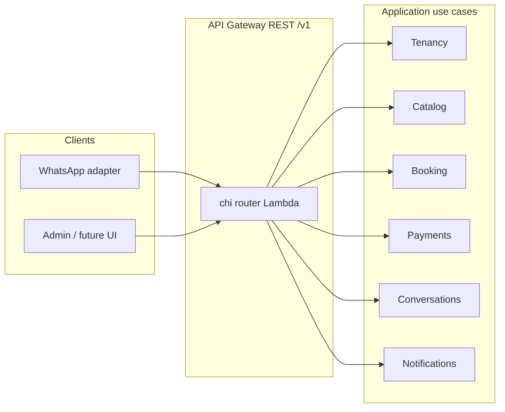

# Planning: API layout, models, and services

Planning artifact for the **Conversational Commerce Engine for Services** (WhatsApp-first). Engineering constraints and stack live in **`ARCHITECTURE.md`**; persistence keys and GSIs in **`DYNAMODB_ARCHITECTURE_AND_SCHEMA.md`**. This file is the working blueprint for REST shape, DDD models, and service boundaries—**not** implemented code.

---

## API layout (REST, versioned, tenant-scoped)

### Conventions

- **Base path:** `/v1`
- **Tenant scope:** Almost everything lives under `/v1/businesses/{businessId}/…` so HTTP isolation aligns with `BUSINESS#{businessId}` in DynamoDB.
- **Auth (to be implemented):** `Authorization` plus tenant membership; platform routes require a platform role. Domain rules assume the caller is scoped to a business or is a platform admin.
- **Errors:** JSON problem details (type, title, detail, `business_id`, `request_id`); map domain failures to **409** / **422** where appropriate.
- **Idempotency:** `Idempotency-Key` on `POST` requests that create appointments or payment intents.

### Resource map

```text
/v1
  /platform                         # platform admin (optional for MVP)
    /businesses
  /businesses/{businessId}
    /services
    /staff
    /customers
    /availability                   # rules or explicit slots
    /bookings
    /payments
    /conversations
    /notifications
  /webhooks
    /whatsapp
    /payments/{provider}
```

### Representative routes

| Area | Method & path | Purpose |
|------|----------------|--------|
| **Tenancy** | `POST /v1/platform/businesses` | Onboard tenant (platform) |
| | `GET`, `PATCH /v1/businesses/{businessId}` | Business profile / settings |
| **Catalog** | `GET`, `POST /v1/businesses/{businessId}/services` | List / create offerings |
| | `GET`, `PATCH`, `DELETE …/services/{serviceId}` | CRUD |
| **Staff** | `GET`, `POST …/staff`, `…/staff/{staffId}` | Staff CRUD |
| **CRM** | `GET`, `POST …/customers` | List / create customer |
| | `GET`, `PATCH …/customers/{customerId}` | Profile |
| | `GET …/customers/by-phone?e164=` | Resolve by phone (GSI2 in adapter) |
| **Availability** | `PUT …/availability` or `…/availability/rules` | Business rules |
| | `GET …/availability/slots?from=&to=&service_id=` | Slots (stored or computed) |
| **Bookings** | `POST …/bookings` | Create (validates slot, staff, service) |
| | `GET …/bookings/{bookingId}` | Detail |
| | `GET …/bookings?from=&to=` | Range list (GSI1: bookings by date) |
| | `POST …/bookings/{bookingId}:confirm` | Transition (or `PATCH` + state) |
| | `POST …/bookings/{bookingId}:cancel` | |
| | `POST …/bookings/{bookingId}:complete`, `:no-show` | |
| **Payments** | `POST …/payments` | Create intent / link (ties to `bookingId`) |
| | `GET …/payments/{paymentId}` | Detail |
| | `GET …/bookings/{bookingId}/payments` | Via GSI3 in adapter |
| **Conversations** | `POST …/conversations` | Open or get-or-create |
| | `GET …/conversations/{conversationId}` | Metadata |
| | `GET …/conversations/{conversationId}/messages` | Paginated |
| | `POST …/conversations/{conversationId}/messages` | Outbound (admin/system); WhatsApp adapter reuses use cases |
| **Notifications** | `POST …/notifications` | Schedule manual / campaign |
| | `GET …/notifications?status=` | Operator list |
| **Webhooks** | `POST /v1/webhooks/whatsapp` | Verify signature → conversation use cases |
| | `POST /v1/webhooks/payments/{provider}` | Confirm / fail payments |

### MVP cut

Platform `POST /businesses`, business CRUD for services / staff / customers, availability + booking CRUD / transitions, minimal conversations + WhatsApp webhook, reminders via scheduled notifications + worker. Not every route must ship on day one.

### Request flow (logical)



---

## Models (DDD — domains own these shapes)

These are **domain / application** models in Go (e.g. `internal/domain/...` or per bounded context). **DynamoDB attribute maps** stay in **infrastructure adapters**, not imported by domain packages.

### Shared value objects (examples)

- IDs: `BusinessID`, `CustomerID`, `ServiceID`, `StaffID`, `BookingID`, `ConversationID`, `PaymentID` (typed strings / ULIDs)
- `PhoneNumber` (E.164), `Money` (amount + currency), `TimeRange`, wall-clock with business **timezone**

### Tenancy

- **Business** (aggregate root): name, legal / trading name, timezone, contact channels, status (`active` | `suspended`), audit timestamps

### Catalog and workforce

- **Service:** business ref, name, duration, price (optional), active, metadata
- **Staff:** business ref, display name, role, service associations or tags, active
- **AvailabilityRule** (or equivalent): staff / service scope, recurrence or exceptions—implementation may **compute** slots vs **store** slot rows

### CRM

- **Customer:** business ref, phone (unique per tenant; GSI2 `PHONE#`), name, preferences, marketing opt-in, audit timestamps

### Booking (core aggregate)

- **Booking:** identifiers, business, customer, service, staff (optional), start / end, status  
  **Status:** `created` → `confirmed` → `completed` | `cancelled` | `no_show`  
- **Invariants:** no double-booking same staff slice; allowed state transitions only; referenced service / customer / staff valid and active where required

### Payments

- **Payment:** booking ref, amount, kind (`deposit` | `full` | `balance`), provider id, external ref, status (`pending` | `succeeded` | `failed` | `refunded`), timestamps

### Conversations

- **Conversation:** customer ref, business ref, channel (`whatsapp`), provider thread ids, conversational **state** (e.g. step in booking flow), last activity
- **Message:** conversation ref, direction (`inbound` | `outbound`), text or structured payload, provider message id, timestamps

### Notifications

- **Notification:** business ref, kind (`reminder` | `confirmation` | `promo`), channel, target (customer / booking ref), `scheduled_at`, status (`scheduled` | `sent` | `failed`), payload

### Integration (conceptual)

- **Domain events** (`BookingCreated`, `PaymentReceived`, …): publish via **EventBridge** / **SQS** with idempotent consumers; optional `EVENT` items in DynamoDB only if an audit or outbox pattern is chosen later

---

## Services (bounded contexts and Lambdas)

### Bounded contexts

| Context | Responsibility | Example ports |
|--------|----------------|---------------|
| **Tenancy** | Business lifecycle, settings | `BusinessRepository`, `Clock` |
| **Catalog** | Services, staff | `ServiceRepository`, `StaffRepository` |
| **Scheduling** | Availability, slot queries, conflict checks | `AvailabilityRepository`, booking reads for overlap |
| **Booking** | Booking aggregate, transitions, events | `BookingRepository`, `DomainEventPublisher`, `NotificationScheduler` |
| **CRM** | Customers, resolve-by-phone | `CustomerRepository` |
| **Payments** | Intents, records, webhooks | `PaymentRepository`, `PaymentProvider` |
| **Conversations** | Session state, messages, channel mapping | `ConversationRepository`, `MessageRepository`, `ChannelOutbound` |
| **Notifications** | Schedule, dispatch, retries | `NotificationRepository`, `Notifier`, due-queue access (GSI4) |
| **Platform** | Cross-tenant onboarding (if used) | `BusinessRepository` + elevated auth |

### Application use cases (examples)

- `RegisterBusiness`, `UpdateBusinessProfile`
- `CreateService`, `ListServices`
- `CreateCustomer`, `FindCustomerByPhone`
- `GetAvailableSlots`, `CreateBooking`, `ConfirmBooking`, `CancelBooking`
- `CreatePayment`, `RecordPaymentWebhook`
- `EnsureConversation`, `AppendInboundMessage`, `SendOutboundMessage`
- `ScheduleBookingReminder`, `DispatchDueNotifications`

### Lambda deployment (Lambda-first)

| Lambda (logical) | Trigger | Role |
|------------------|---------|------|
| **api** | API Gateway (REST), one binary, **chi** | Synchronous REST; thin HTTP adapters |
| **webhook-whatsapp** | API Gateway or Function URL | Verify signature → conversation / booking use cases |
| **webhook-payments** | API Gateway | Provider verify → payment use case |
| **worker-notifications** | EventBridge schedule or SQS | Due notifications (GSI4) |
| **worker-events** (optional) | SQS / EventBridge | Async reactions |

Start with **one `api` Lambda** plus **one combined webhooks Lambda** if desired; split for cold start or blast radius later.

---

## DynamoDB mapping (planner’s cheat sheet)

- Business partition: `PK = BUSINESS#{businessId}`; `SK` per entity types in **`DYNAMODB_ARCHITECTURE_AND_SCHEMA.md`**.
- Customer by phone: **GSI2** `PHONE#{e164}`.
- Bookings by calendar: **GSI1** `BOOKING_DATE#{timestamp}` under business.
- Payments for booking: **GSI3** `BOOKING#{bookingId}`.
- Due notifications: **GSI4** scheduled pattern.

---

## Next steps (implementation)

1. **OpenAPI 3** spec: `openapi/openapi.yaml` (errors, idempotency, schemas — evolve with implementation).  
2. Carve Go packages by **bounded context** with **ports** in application layer and **adapters** for DynamoDB, HTTP, WhatsApp, EventBridge.  
3. Terraform **API Gateway** routes → Lambda; tables and GSIs per data doc.

---

## Document index

| File | Role |
|------|------|
| `ARCHITECTURE.md` | Stack, DDD/hexagonal, delivery |
| `DYNAMODB_ARCHITECTURE_AND_SCHEMA.md` | Keys, entities, GSIs |
| `PRODUCT_REQUIREMENTS_DOCUMENT.md` | Product goals and MVP |
| `REQUIREMENTS_DRAFT.md` | Functional depth |
| `openapi/openapi.yaml` | REST contract (OpenAPI 3.0.3) |
| `IMPLEMENTATION_PLAN.md` | Phased build, Terraform order, CI/CD |
